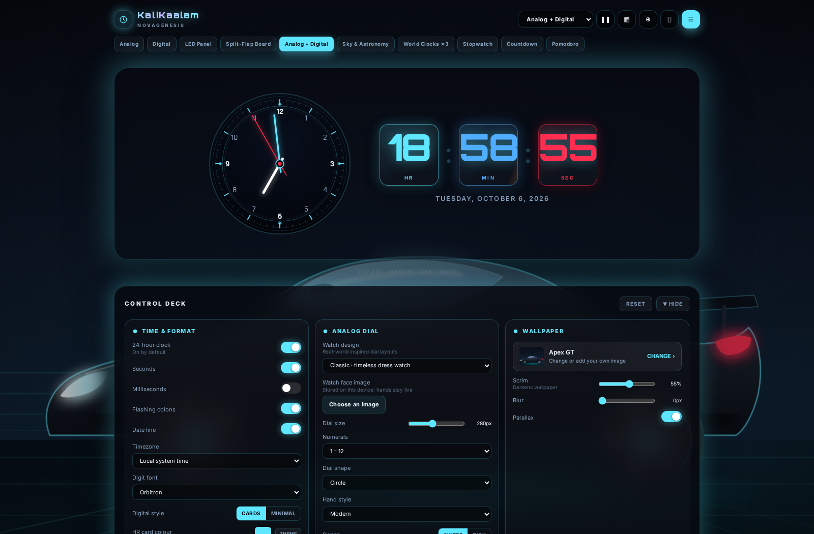

# KaliKaalam — NovaGenesis

### Your personal clock, one click away.

Open KaliKaalam from the browser toolbar whenever you want a clock deck: analog, digital, LED and split-flap displays, astronomy, focus tools and world clocks. It leaves your browser's New Tab page exactly as you set it.

  <a href="https://github.com/MohanKrishna-RC/KaliKaalam/raw/refs/heads/main/release/kalikaalam-chrome-1.0.0.zip"><strong>⬇ Download for Chrome / Edge / Brave</strong></a>
  &nbsp; · &nbsp;
  <a href="https://github.com/MohanKrishna-RC/KaliKaalam/raw/refs/heads/main/release/kalikaalam-firefox-1.0.0.zip"><strong>⬇ Download for Firefox</strong></a>

Version 1.0.0 · Free download · No account required

## Make time your own

- **Four clock faces:** analog, digital, seven-segment LED and animated split-flap.
- **Sky and astronomy:** starfield, constellations, moon phase, twilight, sunrise and sunset, calculated for your selected location.
- **World clocks:** keep favorite cities and time zones in view.
- **Focus tools:** stopwatch with laps, countdown and Pomodoro timer.
- **Personal controls:** themes, accent colors, wallpapers, uploaded backgrounds, sounds, alarms, fullscreen and screen wake lock.
- **Keyboard navigation:** switch between the ten clock and tool views with number keys `0`–`9`.

More screenshots

| Split-flap | World clocks |
|:--:|:--:|
|  |  |

| Sky view | LED display |
|:--:|:--:|
|  |  |

## Install

### Chrome, Edge, Brave and other Chromium browsers

1. Download the [Chromium ZIP](https://github.com/MohanKrishna-RC/KaliKaalam/raw/refs/heads/main/release/kalikaalam-chrome-1.0.0.zip) and extract it.
2. Open your browser's extensions page (`chrome://extensions`, `edge://extensions`, or `brave://extensions`).
3. Turn on **Developer mode**.
4. Select **Load unpacked** and choose the extracted folder containing `manifest.json`.
5. Pin the KaliKaalam toolbar icon if you like, then click it and choose **Open KaliKaalam**. Your normal New Tab page remains unchanged.

### Firefox

1. Download and extract the [Firefox ZIP](https://github.com/MohanKrishna-RC/KaliKaalam/raw/refs/heads/main/release/kalikaalam-firefox-1.0.0.zip).
2. Open `about:debugging#/runtime/this-firefox`.
3. Select **Load Temporary Add-on…** and choose `manifest.json` from the extracted folder.

Firefox temporary add-ons are removed when Firefox closes. A signed AMO release is needed for a persistent Firefox installation.

## Privacy

Your settings, alarms and uploaded wallpapers stay in your browser. Kalikaalam has no account, analytics or backend. It requests only the browser's `storage`, `alarms` and `notifications` permissions, with no host permissions. Google Fonts are requested to display the typefaces; the interface falls back to system fonts if they are unavailable. Location is used only when you choose the location button and is processed locally.

Read the [privacy policy](PRIVACY.md).

## Compatibility

- **Chromium:** Chrome 114 or later (also Edge, Brave and compatible Chromium browsers).
- **Firefox:** Firefox 115 or later; temporary installation instructions are above.

## Releases

Current release: **1.0.0**. Download the browser-specific ZIP above, or browse the [release downloads](https://github.com/MohanKrishna-RC/KaliKaalam/tree/main/release).

## Feedback

Found a problem or have an idea? [Open an issue](https://github.com/MohanKrishna-RC/KaliKaalam/issues).
